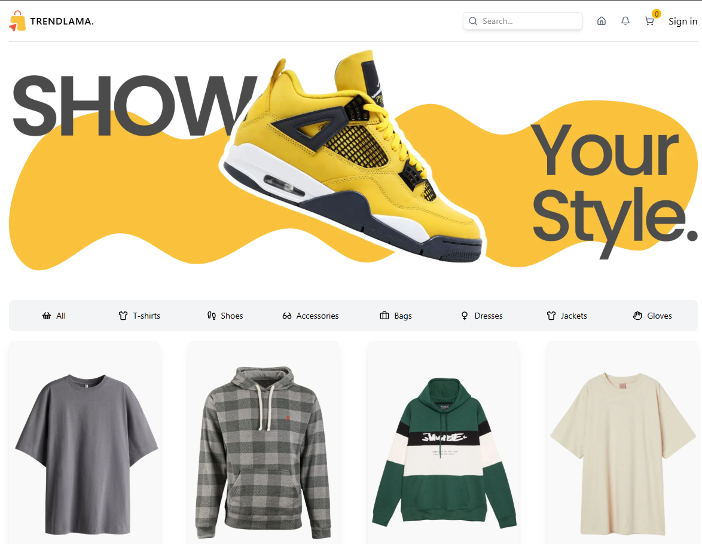

# TrendLama 🦙



## Overview

**TrendLama** is a modern, high-performance e-commerce application built to deliver a premium shopping experience. Designed with a focus on speed, accessibility, and visual aesthetics, this project showcases advanced frontend development skills using the latest React ecosystem technologies.

Check out the live demo here: [**Visite Site**](https://trendlama-flame.vercel.app/)

## ✨ Key Features

- **Store Architecture**: Built on **Next.js 14** (App Router) for server-side rendering, optimal SEO, and blazing fast performance.
- **State Management**: Utilizes **Zustand** for a lightweight, efficient, and scalable global state management solution (Shopping Cart implementation).
- **Type Safety**: Fully typed with **TypeScript** to ensure code reliability and maintainability.
- **Styling**: Crafted with **Tailwind CSS** for a responsive, mobile-first design that looks great on any device.
- **Form Handling**: Robust form validation using **React Hook Form** combined with **Zod** schema validation.
- **UI Components**: Modern, clean interface elements enhanced with **Lucide React** icons.

## 🛠️ Technology Stack

- **Framework**: [Next.js](https://nextjs.org/)
- **Language**: [TypeScript](https://www.typescriptlang.org/)
- **Styling**: [Tailwind CSS](https://tailwindcss.com/)
- **State Management**: [Zustand](https://zustand-demo.pmnd.rs/)
- **Forms & Validation**: [React Hook Form](https://react-hook-form.com/) + [Zod](https://zod.dev/)
- **Icons**: [Lucide React](https://lucide.dev/)

## 🚀 Getting Started

To run this project locally:

1.  **Clone the repository**

    ```bash
    git clone https://github.com/yourusername/trendlama.git
    cd trendlama
    ```

2.  **Install dependencies**

    ```bash
    npm install
    # or
    yarn install
    ```

3.  **Run the development server**

    ```bash
    npm run dev
    # or
    yarn dev
    ```

4.  Open [http://localhost:3000](http://localhost:3000) with your browser to see the result.

---

_This project was built to demonstrate proficiency in modern frontend development practices._
